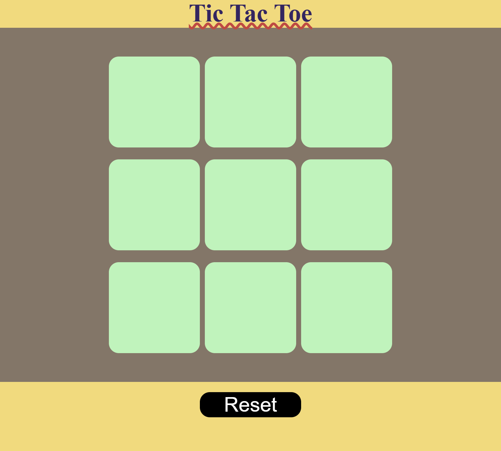
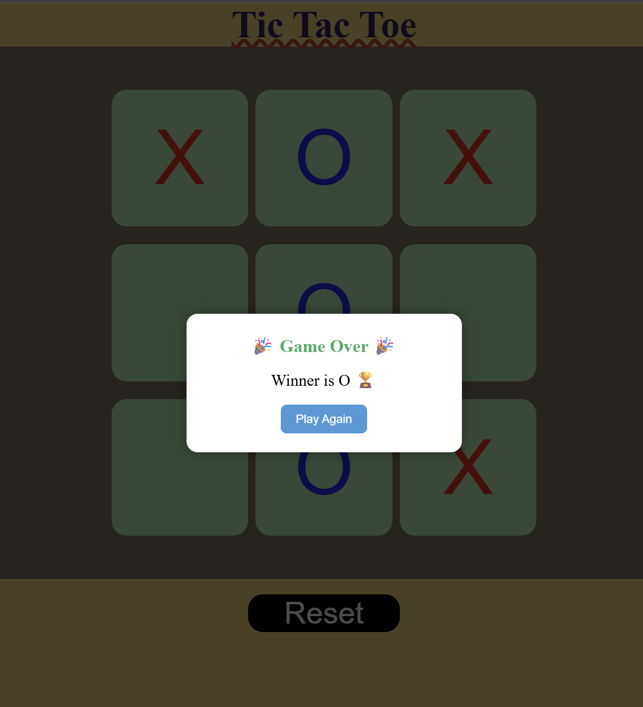

# 🎮 Tic Tac Toe Game

## 📑 Table of Contents

- <a href="#-project-title">📌 Project Title</a>
- <a href="#-brief-summary">📝 Brief Summary</a>
- <a href="(#-project-overview)">📖 Project Overview</a>
- <a href="(#-problem-statement)">❓ Problem Statement</a>
- <a href="#-dataset"> 📊 Dataset</a>
- <a href="#️-tools-and-technologies">🛠️ Tools and Technologies</a>
- <a href="#️-methods">⚙️ Methods</a>
- <a href="#-key-insights">📈 Key Insights</a>
- <a href="#-features">🚀 Features</a>
- <a href="#-project-structure">📂 Project Structure</a>
- <a href=" #-preview">📷 Preview</a>
- <a href="#-future-enhancements">🎯 Future Enhancements</a>
- <a href="#-author">👩‍💻 Author</a>

---

## 📌 Project Title

**Tic Tac Toe Game using HTML, CSS, and JavaScript**

---

## 📝 Brief Summary

A simple, interactive, and responsive Tic Tac Toe game built using HTML, CSS, and JavaScript that allows two players to play alternately and automatically detects the winner or a draw.

---

## 📖 Project Overview

This project is a browser-based implementation of the classic Tic Tac Toe game. It provides an engaging user interface where two players can compete by placing their respective marks (**X** and **O**) on a **3×3 grid**. The game automatically checks for winning combinations after each move, displays the winner, detects draw situations, and allows users to restart or begin a new game.

The project demonstrates the use of JavaScript DOM manipulation, event handling, conditional logic, and responsive web design.

---

## ❓ Problem Statement

The objective of this project is to develop an interactive web-based Tic Tac Toe game that:

- Allow two players to play alternately.
- Prevent invalid moves by disabling occupied cells.
- Detect winning conditions automatically.
- Identify draw situations.
- Provide options to restart or start a new game without refreshing the page.

---

## 📊 Dataset

This project does **not** require any external dataset.

Instead, it uses:

- User click events as input.
- A predefined list of winning combinations stored in JavaScript.

Example:

```javascript
const winPatterns = [
  [0, 1, 2],
  [3, 4, 5],
  [6, 7, 8],
  [0, 3, 6],
  [1, 4, 7],
  [2, 5, 8],
  [0, 4, 8],
  [2, 4, 6],
];
```

---

## 🛠️ Tools and Technologies

| Technology         | Purpose                       |
| ------------------ | ----------------------------- |
| HTML5              | Structure of the webpage      |
| CSS3               | Styling and responsive design |
| JavaScript (ES6)   | Game logic and interactivity  |
| Visual Studio Code | Code editor                   |
| Git                | Version control               |
| GitHub             | Project hosting               |

---

## ⚙️ Methods

The project follows these steps:

1. Create the game board using HTML.
2. Style the board using CSS.
3. Add click event listeners to each cell.
4. Alternate turns between Player X and Player O.
5. Store player moves.
6. Check all winning combinations after every move.
7. Display the winner if a winning pattern is found.
8. Detect draw situations.
9. Disable further moves after the game ends.
10. Restart or start a new game when requested.

---

## 📈 Key Insights

- Learned JavaScript DOM manipulation.
- Improved understanding of event handling.
- Implemented game logic using arrays and conditional statements.
- Used functions to organize reusable code.
- Built a responsive and interactive web application.
- Strengthened problem-solving and debugging skills.

---

## 🚀 Features

- ✅ Two-player gameplay
- ✅ Winner detection
- ✅ Draw detection
- ✅ Restart Game button
- ✅ New Game button
- ✅ Responsive user interface
- ✅ Simple and clean design

---

## 📂 Project Structure

```text
Tic-Tac-Toe/
│── index.html
│── style.css
│── script.js
└── README.md
```

---

## 📷 Preview




---

## 🎯 Future Enhancements

- 🤖 Single-player mode with AI.
- 🏆 Scoreboard for tracking wins.
- 🔊 Sound effects.
- 🎨 Dark/Light mode.
- 🎭 Better animations.
- 🌐 Online multiplayer support.

---

## 👩‍💻 Author

**Khushi Shaw**

## <a href="https://www.linkedin.com/in/khushi-shaw-developer" target="_blank">Tap to follow my linkdin profile</a>

⭐ **If you found this project useful, don't forget to star the repository!**
